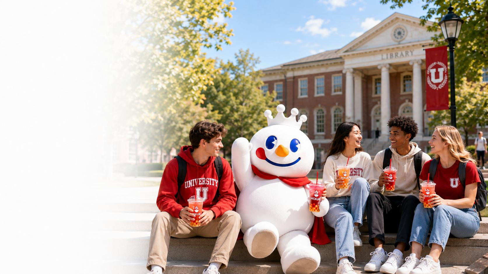
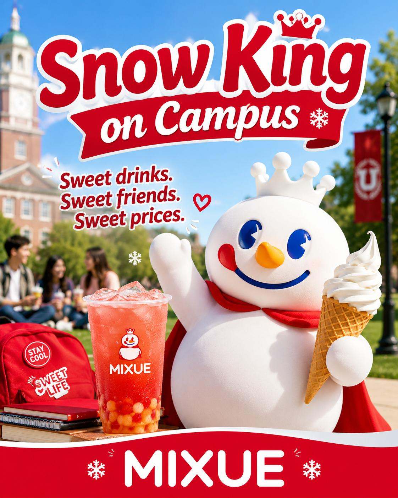
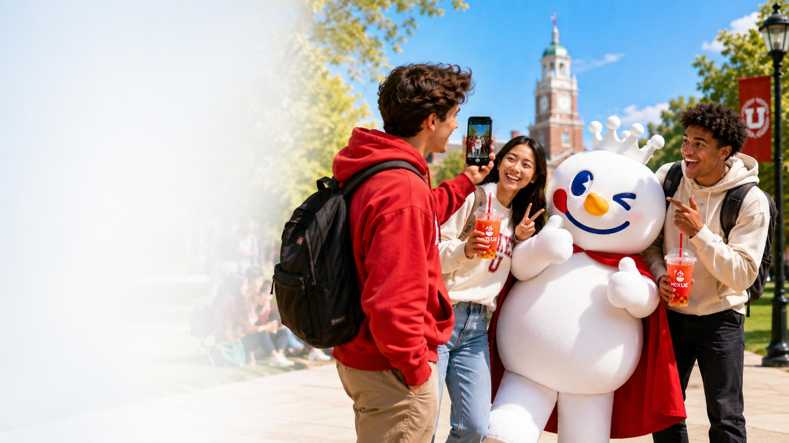
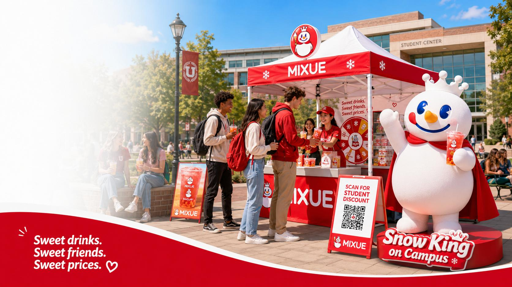

<!-- page 1 -->

## **SNOW KING
ON CAMPUS**

An AI-powered Cross-cultural Campaign
for MIXUE in the U.S. College Market

**MIXUE × U.S. CAMPUS**

### **Sweet drinks.
Sweet friends.
Sweet prices.**

01

<!-- page 2 -->

**BRAND CHOICE**

## **Why MIXUE?**

The brand already has the ingredients for a youth campaign.

### **One brand.
Three reasons.
One clear fit.**

**Affordable**

Student-friendly prices make MIXUE easy to try.

**Meme-friendly**

Snow King is simple, cute and highly shareable.

**Campus-fit**

02

Naturally connected to casual student life.

<!-- page 3 -->

**TARGET MARKET**

**The sweet spot**

Fun enough for social life. Affordable enough for everyday campus life.

**Current choices**

### **\$5–7**

bubble tea / Starbucks
often feels premium

**MIXUE opportunity**

## **\$2–4**

**fun · refreshing · casual
student-friendly prices**

**A clear gap: affordable drinks that still feel interesting and social.**

03

<!-- page 4 -->

**CULTURAL INSIGHT**

## **Why culture matters**

China is high-context. U.S. college communication is low-context.

**CHINA**

### **High-context**

**• shared meaning**

**• relationships matter**

**• indirect cues**

**• context carries meaning**

**translate clearly**

**U.S. COLLEGE MARKET**

### **Low-context**

**• clear words**

**• direct expression**

**• spelled-out information**

**• easy to understand quickly**

**So the campaign message must be simple, direct, and immediately clear.**

04

<!-- page 5 -->

## **TWO RISKS TO SOLVE**

Low-context communication means the brand message cannot rely on shared Chinese context.

**01**

### **Snow King may look childish**

Reframe him as a funny campus buddy.

**02**

### **Low price may suggest low quality**

Present MIXUE as a smart choice for students.

**We do not change MIXUE. We make the message easier to get.**

05

<!-- page 6 -->

**TRANSLATION PROBLEM**

## **From Chinglish to campus English**

The goal is not word-for-word translation, but communication.

### **Original Chinese**

你爱我，我爱你
蜜雪冰城甜蜜蜜

**Bad direct translation**

You love me,
I love you,
MIXUE sweet
sweet honey.

### **Final slogan**

Sweet drinks.
Sweet friends.
Sweet prices.

**Direct translation sounds awkward. Recasting makes it memorable.**

06

<!-- page 7 -->

**TRANSLATION STRATEGY**

## **Recasting**

Keep the emotional core. Rewrite the expression.

### **Not word-for-word.**

We do not copy the Chinese line directly.

We rebuild it as an English campus slogan.

**communication-oriented**

### **Sweet
drinks.**

**product +
sweetness**

### **Sweet
friends.**

**campus
social life**

### **Sweet
prices.**

**affordability**

**Recasting lets the slogan sound natural, memorable, and ad-friendly in English.**

07

<!-- page 8 -->

**CONCEPT POSTER**

## **The slogan in context**

This is where translation becomes communication.

### **Final slogan in context**

Poster-ready and social-media-ready.

### **Snow King + campus setting**

The mascot is moved into student life.

### **Visual proof**

The English slogan works as a real brand message.

08

<!-- page 9 -->

**LOCALIZATION STRATEGY**

## **Same identity, easier access.**

Localization means adapting the context, not deleting the Chinese identity.

**KEEP**

### **Snow King
MIXUE name
Red-and-white identity
Tea drinks**

**ADAPT**

**Campus buddy
Clear English slogan
Student-life visuals
Sweet-break story**

**Same Snow King. New campus story.**

09

<!-- page 10 -->

**CAMPAIGN IDEA**

## **TikTok Snow
King Challenge**

Students post their own
“sweet break” moments
between classes.

**#SweetBreak**

### **Why it works**

Interactive
Student-made
Meme-friendly

10

<!-- page 11 -->

**ACTIVATION**

## **Campus Pop-up Booth**

Try drinks.
Take photos.
Use student discounts.

### **Core actions**

drink tasting
photo spot
QR coupon

### **Extra idea**

Offer a less-sugar option for health-conscious students.

11

<!-- page 12 -->

**AI WORKFLOW**

## **How AI supported our project**

AI generated options; human judgment made the final decisions.

**1**

### **Brand analysis**

**sweet · friendly
affordable · Snow King**

**2**

### **Slogan options**

**narrative line vs.
advertising slogan**

**3**

### **Concept poster**

**visual test in
campus context**

**AI was a creative assistant, not the final decision-maker.**

12

<!-- page 13 -->

**EVALUATION PLAN**

## **Performance + cultural acceptance**

We measure not only views, but also understanding.

### **Attention**

views · QR scans

### **Engagement**

likes · comments · shares

### **Conversion**

coupon use · pop-up visits

### **Acceptance**

surveys · comment analysis

**Success means students understand Snow King as fun, friendly, affordable, and campus-friendly.**

13

<!-- page 14 -->

## **SAME SNOW KING,
NEW CAMPUS STORY.**

MIXUE becomes fun, friendly, affordable,
and easy to understand for U.S. college students.

**THANK YOU**

14

<!-- page 15 -->

**APPENDIX**

## **AI Evidence: Prompt → Output → Human Decision**

Submission evidence; not all pages need to be presented.

**1. Brand Analysis**

AI summarized MIXUE’s identity.

Output keywords: sweetness, friendliness, affordability, Snow King, young consumers.

Human use: selected these as translation keywords.

**2. Slogan Translation**

AI rewrote the Chinese slogan for U.S. college students.

Output: multiple slogan directions.

Human decision: selected the poster-ready slogan.

**3. Image Generation**

Image2 visualized the slogan with Snow King and a U.S. campus setting.

Output: concept poster.

Human use: visual proof, not final commercial material.

### **AI generated options; human judgment made the final communication decisions.**

15

<!-- page 16 -->

**APPENDIX A**

## **Prompt 1: Brand Core Analysis**

AI helped us identify the brand message before rewriting the slogan.

**PROMPT**

Analyze MIXUE’s brand identity for a cross-cultural communication project.

Focus on:
- slogan
- Snow King mascot
- product features
- price positioning
- emotional message

Summarize the brand core in simple English.

### **AI Output**

sweet · friendly · affordable · youthful · mascot-driven

### **Human Adjustment**

Selected four key ideas: sweetness, friendship, affordability, and Snow King.

These became the basis of our final slogan and poster design.

16

<!-- page 17 -->

**APPENDIX B**

## **Prompt 2: Slogan Translation**

This prompt guided AI to avoid Chinglish and generate several slogan options.

**YAML-STYLE PROMPT**

task: Rewrite MIXUE's Chinese slogan for U.S. college students.

source\_slogan: 你爱我，我爱你，蜜雪冰城甜蜜蜜
bad\_example: You love me, I love you, MIXUE sweet sweet honey.

requirements:
  - avoid Chinglish
  - keep sweetness and friendliness
  - show affordability
  - fit campus friendship and student life
  - make it short, natural, and suitable for posters

output:
  - give 5 slogan versions
  - explain strengths and weaknesses
  - recommend the best version

### **AI Output Examples**

1. MIXUE brings sweetness to campus life, one cup at a time.
2. Sweet drinks. Sweet friends. Sweet prices.

### **Human Selection**

Final slogan: “Sweet drinks. Sweet friends. Sweet prices.”

### **Reason for Choice**

Shorter, clearer, poster-ready, and directly reflects drinks, friendship, and affordability.

17

<!-- page 18 -->

**APPENDIX C**

## **Prompt 3: Image2 Concept Poster**

Image generation helped visualize whether the slogan could work in a real communication context.

**IMAGE2 PROMPT**

Create a polished promotional poster for MIXUE aimed at U.S. college students.

Theme: Snow King on Campus
Main slogan: Sweet drinks. Sweet friends. Sweet prices.

Visual requirements:
- red-and-white MIXUE style
- Snow King as a cheerful campus buddy
- U.S. college campus setting
- MIXUE drinks and soft-serve product visuals
- fun, sweet, affordable, student-friendly mood
- clean layout suitable for an English presentation

### **AI Output**

A concept poster with Snow King, campus setting, MIXUE products, and final slogan.

### **Human Adjustment**

Used it as a sample visual, not as a final commercial poster.

### **How AI Supported the Decision**

The image tested whether our slogan could move from translation to campaign communication.

18

<!-- page 19 -->

**APPENDIX D**

## **AI Output → Human Adjustment Summary**

A concise evidence table for the project requirements.

**AI Task**

**Generated Output**

**Human Adjustment**

**Final Use**

**Brand analysis**

brand keywords

selected four key ideas

translation basis

**Slogan rewriting**

multiple versions

selected strongest slogan

main slogan

**Image generation**

concept poster

used as sample visual

poster slide

### **Requirement covered: prompts, outputs, adjustments, and decision support.**

19